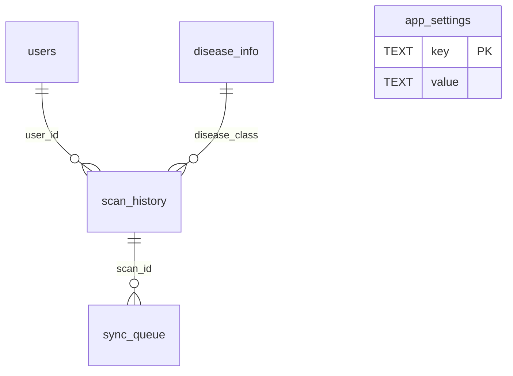

# Local SQLite database

## Database lifecycle

The database service uses `expo-sqlite` and opens `plantcare.db`. On
initialization it enables `PRAGMA foreign_keys = ON`, creates missing tables,
runs additive column/index migration checks, and seeds/upserts the disease
catalog. The SQLite file and records are local to the application installation
and device.

There is no database version table or numbered migration registry. Migration
code inspects `PRAGMA table_info` and adds only missing columns, preserving
existing tables/rows. Specifically, it adds scan columns `model_version`
(default `'legacy-unknown'`), `image_thumbnail_path`, and `deleted_at`; user
columns `email`, `auth_provider_id`, and `updated_at`; and disease columns
`crop`, `image`, `short_description`, `symptoms`, `cause`, `prevention`, and
`cure_status`. It creates the unique Firebase UID index and normalizes legacy
`mock-v0` model-version values to `legacy-unknown`. Existing profile and scan
records are not cleared by initialization.

## Tables and keys

### `users`

| Column | SQLite declaration | Constraints/default |
|---|---|---|
| `id` | INTEGER | Primary key, autoincrement |
| `display_name` | TEXT | Nullable |
| `email` | TEXT | Nullable |
| `auth_provider_id` | TEXT | Nullable; unique index `users_auth_provider_id_unique` |
| `created_at` | DATETIME | Default `datetime('now')` |
| `updated_at` | DATETIME | Nullable |

`auth_provider_id` stores the Firebase UID, not a password or token. The
initial legacy local profile is inserted as row `id = 1`, display name
`Farmer` if absent. Guest/account rows are added as needed.

### `disease_info`

| Column | SQLite declaration | Constraints/default |
|---|---|---|
| `class_name` | TEXT | Primary key |
| `display_name` | TEXT | NOT NULL |
| `crop` | TEXT | Nullable |
| `image` | TEXT | Nullable catalog asset key |
| `description` | TEXT | NOT NULL |
| `short_description` | TEXT | Nullable |
| `symptoms` | TEXT | Nullable |
| `cause` | TEXT | Nullable |
| `treatment` | TEXT | NOT NULL |
| `prevention` | TEXT | Nullable |
| `cure_status` | TEXT | Nullable |
| `severity` | TEXT | NOT NULL, default `'medium'` |

This table is seeded/upserted from the `diseaseInfo` array in
`src/constants/diseaseInfo.js`. That source contains the authoritative
22-class content and maps each `image` key to a bundled local asset. It is
not a separately authored catalog in Firebase.

### `scan_history`

| Column | SQLite declaration | Constraints/default |
|---|---|---|
| `id` | INTEGER | Primary key, autoincrement |
| `user_id` | INTEGER | NOT NULL; FK to `users(id)` |
| `image_path` | TEXT | NOT NULL; persisted original scan URI |
| `image_thumbnail_path` | TEXT | Nullable; generated thumbnail URI |
| `disease_class` | TEXT | NOT NULL; FK to `disease_info(class_name)` |
| `confidence` | REAL | NOT NULL |
| `is_uncertain` | BOOLEAN | NOT NULL, default `0` |
| `scanned_at` | DATETIME | NOT NULL, default `datetime('now')` |
| `synced` | BOOLEAN | NOT NULL, default `0` |
| `model_version` | TEXT | NOT NULL, default `'plantcare-v1.0'` |
| `deleted_at` | DATETIME | Nullable soft-delete timestamp |

The foreign keys have no explicit cascade action. History operations filter by
active `user_id`; visible rows have `deleted_at IS NULL`, and are ordered by
`scanned_at DESC`. There is no scan-history index explicitly created by the
service; primary keys and the user UID unique index are the explicit indexes.

### `sync_queue`

| Column | SQLite declaration | Constraints/default |
|---|---|---|
| `id` | INTEGER | Primary key, autoincrement |
| `scan_id` | INTEGER | NOT NULL; FK to `scan_history(id)` |
| `attempt_count` | INTEGER | NOT NULL, default `0` |
| `last_attempt_at` | DATETIME | Nullable |

When Settings' sync preference is enabled, a new scan gets a queue row. The
repository has no uploader, retry worker, backend endpoint, or cloud restore;
the queue is not evidence of a working sync feature.

### `app_settings`

| Column | SQLite declaration | Constraints/default |
|---|---|---|
| `key` | TEXT | Primary key |
| `value` | TEXT | NOT NULL |

Observed keys include `has_onboarded`, `guest_user_id`, and `sync_enabled`.
`has_onboarded` uses `'1'` for complete; `guest_user_id` stores the persisted
Guest row ID; `sync_enabled` stores `'true'` or `'false'`. Theme mode is not
stored here: `ThemeContext` uses AsyncStorage key `@plantcare/theme`.

## Initialization and seed behavior

`getDatabase` shares an in-flight initialization promise among concurrent
callers. Initialization opens SQLite, enables foreign keys, creates tables,
migrates, and then in a transaction ensures legacy Farmer row `id = 1` exists
and upserts each current `diseaseInfo.js` entry. Catalog values are refreshed
from the bundled source at initialization rather than maintained as
independent server metadata.

## Relationships

## Local profile ownership

`activeLocalUserId` is held in memory by the database service. The Guest
profile ID is persisted in `app_settings.guest_user_id`, allowing the app to
restore the unlinked guest profile across launches. If the Farmer row is
linked to Firebase, a separate guest profile is created so Guest mode does
not view that account's scans. When authenticated, Firebase UID resolves to a
local `users` row and History queries are restricted to that local row ID.

## Scan files and deletion

The source scan is copied to app documents `scans/` before insertion when a
documents directory is available. A best-effort 150 × 150 thumbnail is
generated at JPEG compression 0.7. History uses the thumbnail if present and
the original path otherwise; Result history detail uses the original.

History delete and Settings clear-history mark rows with `deleted_at`.
Undo clears that timestamp. These operations do not issue physical DELETE
statements for scan rows or invoke file deletion in the current flow, so they
are soft-delete/UI-hide operations.

## Existing documentation pointers

This file is the maintained schema reference. The older root-level
`database_schema.md` and `docs/database_schema.md` are retained as links to
this document to avoid divergent copies.
