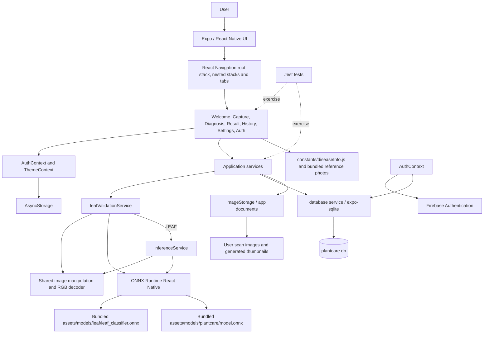
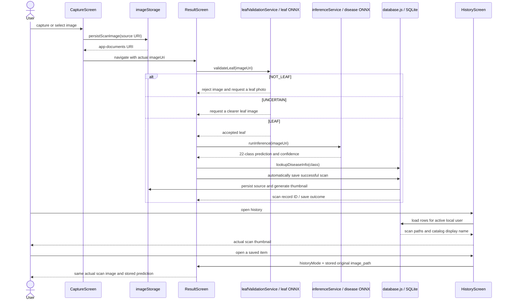
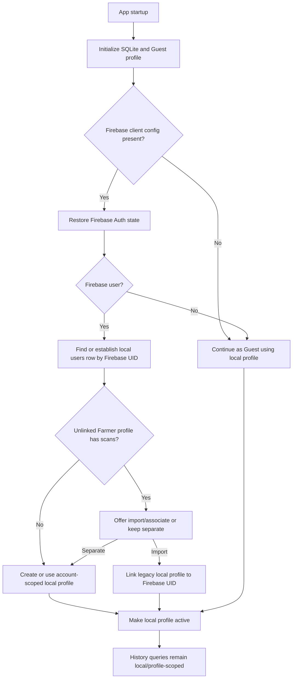
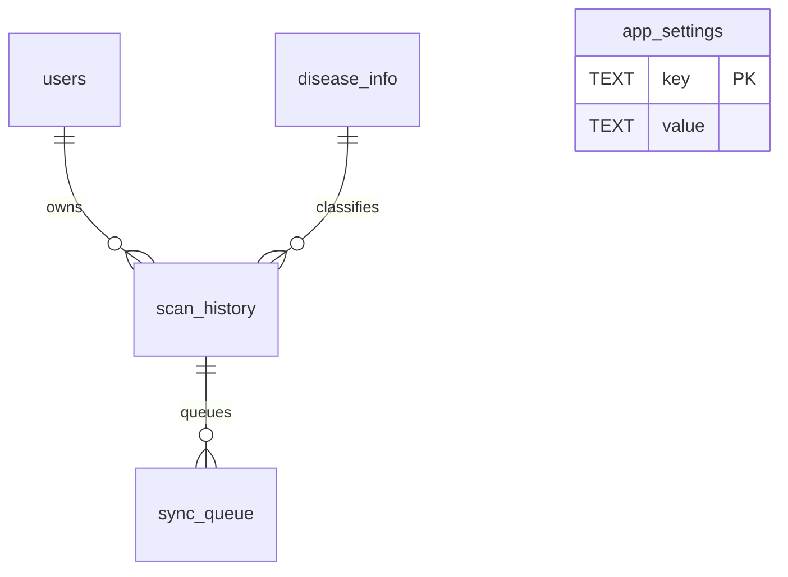

# System architecture

## High-level architecture

## Layers and ownership

- **UI:** `src/screens/` contains Welcome, Capture, Diagnosis, Result, History,
  Settings, and Auth. `src/components/` contains reusable presentation
  elements and badges.
- **Navigation:** `src/navigation/AppNavigator.js` defines the root Welcome /
  Main / Auth stack, four bottom tabs, and nested Capture and History stacks.
  It owns the custom fixed floating tab bar.
- **Application state:** `AuthContext` coordinates Firebase state with local
  user-profile resolution. `ThemeContext` owns the explicit Light/Dark
  preference and palette.
- **Services:** `database.js` owns SQLite creation, migrations, seeding,
  profiles, scans, and settings. `leafValidationService.js` runs first and
  returns LEAF, NOT_LEAF, or UNCERTAIN. Only LEAF proceeds to
  `inferenceService.js`, which retains the existing disease-model loading,
  image tensor creation, inference, and class output. `imageStorage.js` copies
  images, creates thumbnails, and deletes individual image files. `authService.js`
  wraps Firebase Authentication. `historyNavigation.js` listens for History
  focus refreshes.
- **ML/data:** the leaf-validation ONNX model is bundled at
  `assets/models/leaf/leaf_classifier.onnx`; the unchanged 22-class disease
  ONNX model is bundled at `assets/models/plantcare/model.onnx`.
  `diseaseInfo.js` is the authoritative application metadata and local image
  map; SQLite is seeded/upserted from it. Reference photos live in
  `assets/diseases/`.
- **Persistence:** SQLite holds records/catalog/settings; app documents hold
  user images; AsyncStorage holds theme and Firebase's persisted auth state.
- **Validation:** Jest tests under `__tests__/` cover UI behavior, services,
  catalog and persistence contracts. Android is built with Expo prebuild
  configuration and the Gradle wrapper.

## Detection and scan/history data flow

Result's hero and History images originate from the scan record/URI. Catalog
reference photos are used for Diagnosis cards and are not substituted.

The leaf gate runs before disease inference and uses the existing shared image
preprocessing helper. It classifies probability >= 0.60 as LEAF, <= 0.40 as
NOT_LEAF, and intermediate values as UNCERTAIN. It is a preliminary
validation layer, not a guaranteed non-leaf detector. The gate does not alter
the disease model or its preprocessing, input tensor shape, output class
order, output handling, or inference logic.

## Authentication/local-profile flow

Firebase authenticates identities; SQLite remains the application data store.
No Firebase scan upload or cloud history is represented.

## Database relationships

`app_settings` is a local key/value table and does not reference a user. The
actual columns, keys, and migration strategy are documented in
[database.md](./database.md).

## Important boundaries

- Firebase Authentication does not store local scan history or images.
- The sync queue is dormant scaffolding; there is no queue processor/server
  synchronization implementation.
- Disease reference assets and the ONNX model are bundled. User scan files are
  copied to the app's private documents directory where available.
- The app may request remote content for the Diagnosis decorative hero image;
  this does not affect local inference or bundled disease cards.
